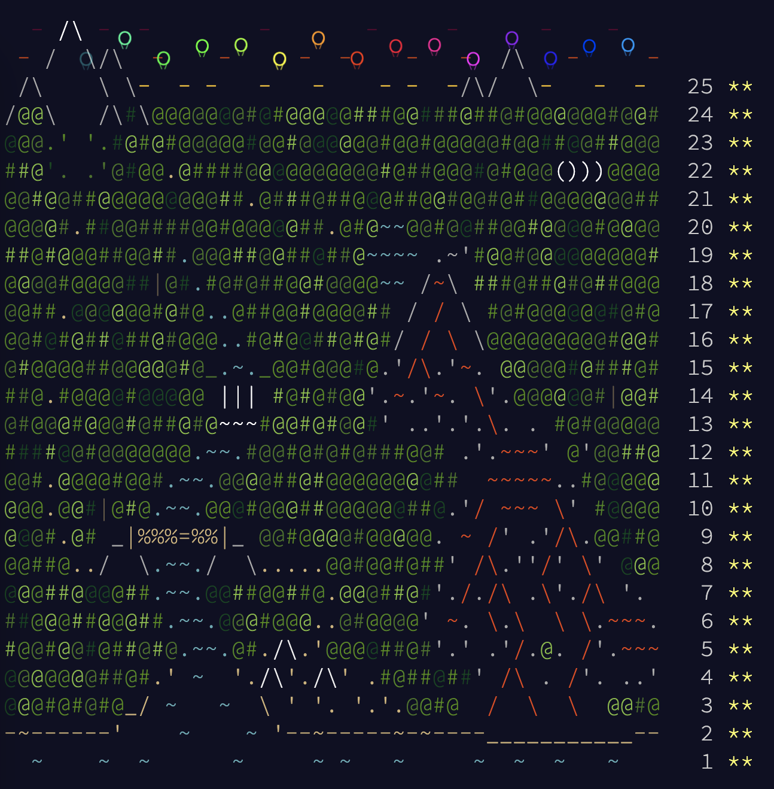

# Journey

The journey began with a task so mundane \
Calorie counting, a chore that's so plain\
But it set the tone for the days to come \
Full of challenges, but also some fun

Rock Paper Scissors, a game we played
A way to pass the time, it never fades
But it was just the start of our toil
Rucksack reorganization, no time to boil

Camp cleanup was next on the list
A never-ending task, we couldn't resist
Supply stacks, a task that's so true
Tuning trouble, a challenge we knew

No space left on device, a frustration to say
But we persevered and found a way
Treetop tree house, a dream come true
Rope bridge, a test of courage and poise

Cathode-ray tube, a relic of the past
Monkey in the middle, a game that lasts
Hill climbing algorithm, a mental feat
Distress signal, a call for help we must meet

Regolith reservoir, a discovery so grand
Beacon exclusion zone, a place we must stand
Proboscidea volcanium, a sight to behold
Pyroclastic flow, a danger we must fold

Boiling boulders, a heat we must withstand
Not enough minerals, a loss we must understand
Grove positioning system, a guide to the way
Monkey math, a puzzle we must play

Monkey map, a path we must find
Unstable diffusion, a task that's unkind
Blizzard basin, a cold we must brave
Full of hot air, a challenge we must face

Through it all we persevered and thrived
This journey, a memory we will always cherish and keep alive

(ChatGPT)
